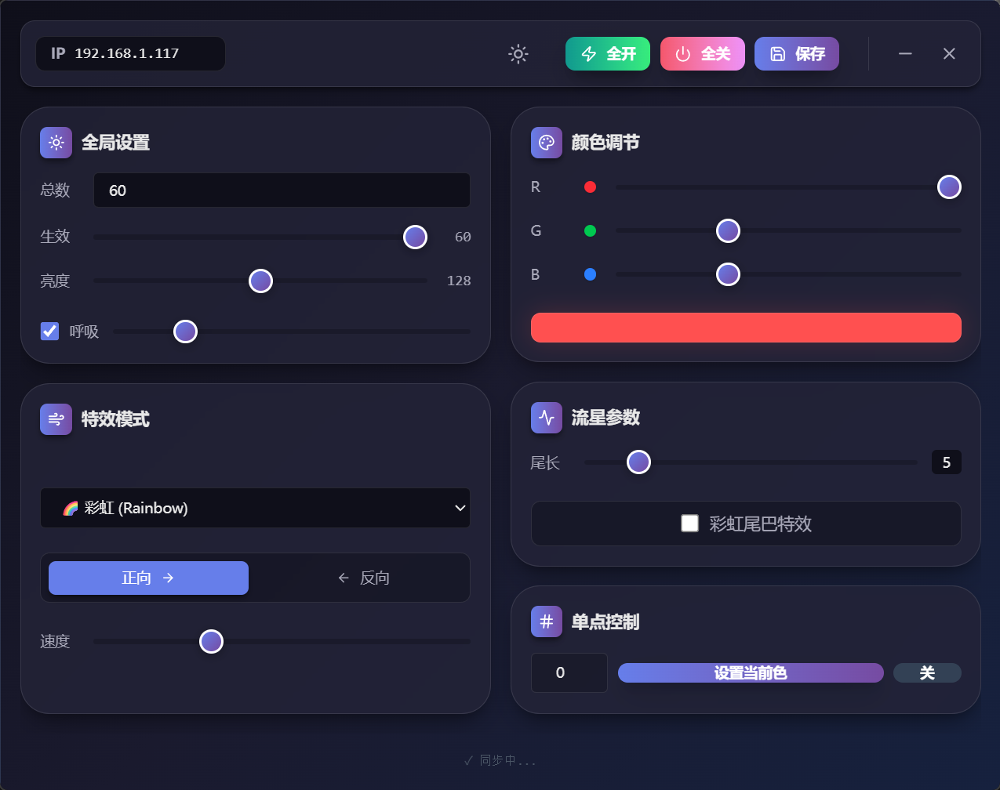
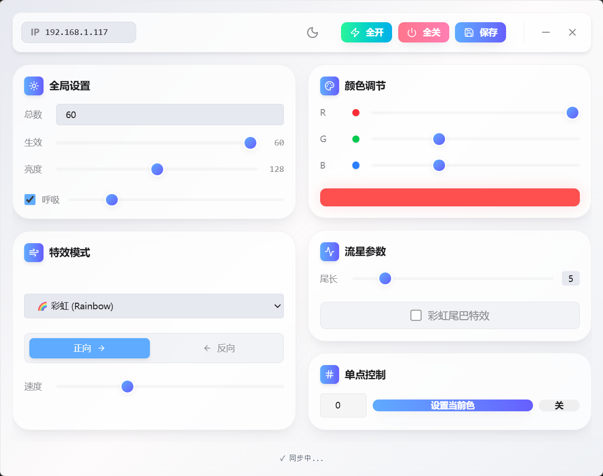

# LED Controller

[](https://github.com/Cans518/LED-Contrller/actions/workflows/build.yml)
[](LICENSE)

[English](#english) | [中文](#中文)

---

<a id="english"></a>
## English

**LED Controller** is a modern, cross-platform desktop and mobile application designed to control WS2812 LED strips connected to an ESP32 microcontroller via WiFi (UDP). Built with **Tauri v2**, **React**, and **Tailwind CSS**, it offers a sleek, themeable UI for real-time lighting effects.

### 🎨 Screenshots

<!-- Add your screenshots here -->
| Dark Theme | Light Theme |
|:-----------:|:-----------:|
|  |  |

### ✨ Features

*   **Real-time Control**: Low-latency UDP communication with ESP32.
*   **🌗 Light/Dark Theme**: Toggle between a vibrant **Cyberpunk Dark** mode and a fresh **Glassmorphism Light** mode. Your preference is saved and persists across sessions.
*   **Global Settings**:
    *   Adjust Total LED count and Active Length.
    *   Global Brightness control.
    *   **Breathing Mode** with adjustable frequency.
*   **Lighting Effects**:
    *   🌈 **Rainbow**: Smooth color transitions.
    *   ☄️ **Comet**: Moving light trail with adjustable tail length and "Rainbow Tail" mode.
    *   💡 **Static**: Solid color display.
    *   ✨ **Blink**: Strobe effect.
    *   🎭 **Marquee**: Theater-style chasing lights.
    *   Adjustable **Speed** and **Direction** (Forward/Reverse) for animations.
*   **Color Management**: Precise RGB sliders with visual preview.
*   **Pixel-Level Control**: Address individual LEDs to set specific colors or turn them off.
*   **Quick Actions**: "All On", "All Off", and "Save" configuration to ESP32 non-volatile memory.
*   **Cross-Platform**: Builds for **Windows**, **macOS**, **Linux**, and **Android**.

### 🛠️ Tech Stack

*   **Core**: [Tauri v2](https://v2.tauri.app/) (Rust + Webview)
*   **Frontend**: React, TypeScript, Vite
*   **Styling**: Tailwind CSS, Lucide React (Icons)
*   **Communication**: UDP Socket (via Tauri Rust backend)

### 🚀 Getting Started

#### Prerequisites
*   Node.js (LTS)
*   Rust (Stable)
*   Android Studio (for Android builds)

#### Development
```bash
# Install dependencies
npm install

# Run in development mode (Desktop)
npm run tauri dev

# Run in development mode (Android)
npm run tauri android dev
```

### 📦 Building

This project uses **GitHub Actions** for automated cross-platform builds.
*   **Trigger**: Push to `main` branch or manually via "Actions" tab.
*   **Artifacts**: Windows (`.exe`), macOS (`.dmg`), Linux (`.deb`/`.AppImage`), Android (`.apk`).

_Note: For Android builds, the CI workflow automatically initializes the Android project structure._

### 📄 License

This project is licensed under the [MIT License](LICENSE).

---

<a id="中文"></a>
## 中文

**LED Controller** 是一款现代化的跨平台桌面及移动端应用程序，用于通过 WiFi (UDP) 控制连接到 ESP32 的 WS2812 LED 灯带。本项目采用 **Tauri v2**、**React** 和 **Tailwind CSS** 构建，提供了精致、可切换主题的 UI，实现实时的灯光效果控制。

### 🎨 截图

<!-- 在这里添加你的截图 -->
| 深色主题 | 浅色主题 |
|:-----------:|:-----------:|
|  |  |

### ✨ 功能特性

*   **实时控制**: 基于 UDP 协议与 ESP32 进行低延迟通信。
*   **🌗 明暗主题切换**: 在酷炫的 **赛博朋克深色** 模式和清新的 **毛玻璃浅色** 模式之间自由切换。选择会自动保存，下次打开应用时自动恢复。
*   **全局设置**:
    *   设置灯珠总数 (Total LEDs) 和有效长度 (Active Length)。
    *   全局亮度调节。
    *   **呼吸模式**: 支持调节呼吸频率。
*   **灯光特效**:
    *   🌈 **彩虹 (Rainbow)**: 平滑的色彩渐变流动。
    *   ☄️ **流星 (Comet)**: 移动的光斑拖尾效果，支持调节尾巴长度和"彩虹尾巴"模式。
    *   💡 **静态 (Static)**: 纯色显示。
    *   ✨ **闪烁 (Blink)**: 频闪效果。
    *   🎭 **跑马灯 (Marquee)**: 剧院式的追逐灯光。
    *   支持调节动画的 **速度** 和 **方向** (正向/反向)。
*   **颜色管理**: 精确的 RGB 滑块控制与颜色预览。
*   **单点控制**: 可指定任意 ID 的灯珠单独设置颜色或关闭。
*   **快捷操作**: 一键"全开"、"全关"，以及"保存"配置到 ESP32 掉电存储。
*   **跨平台支持**: 支持构建 **Windows**, **macOS**, **Linux** 和 **Android** 版本。

### 🛠️ 技术栈

*   **核心框架**: [Tauri v2](https://v2.tauri.app/) (Rust + Webview)
*   **前端框架**: React, TypeScript, Vite
*   **样式库**: Tailwind CSS, Lucide React (图标)
*   **通信协议**: UDP Socket (通过 Tauri Rust 后端实现)

### 🚀 快速开始

#### 环境要求
*   Node.js (LTS)
*   Rust (Stable)
*   Android Studio (如果需要构建安卓版本)

#### 开发指南
```bash
# 安装依赖
npm install

# 启动开发模式 (桌面端)
npm run tauri dev

# 启动开发模式 (安卓端)
npm run tauri android dev
```

### 📦 构建与发布

本项目使用 **GitHub Actions** 进行自动化的跨平台构建。
*   **触发方式**: 推送代码到 `main` 分支，或在 GitHub "Actions" 页面手动触发。
*   **构建产物**: Windows (`.exe`), macOS (`.dmg`), Linux (`.deb`/`.AppImage`), Android (`.apk`)。

_注意：对于安卓构建，CI 工作流会自动初始化所需的安卓项目结构，无需本地提交庞大的安卓工程文件。_

### 📄 开源许可

本项目基于 [MIT 许可证](LICENSE) 开源。
